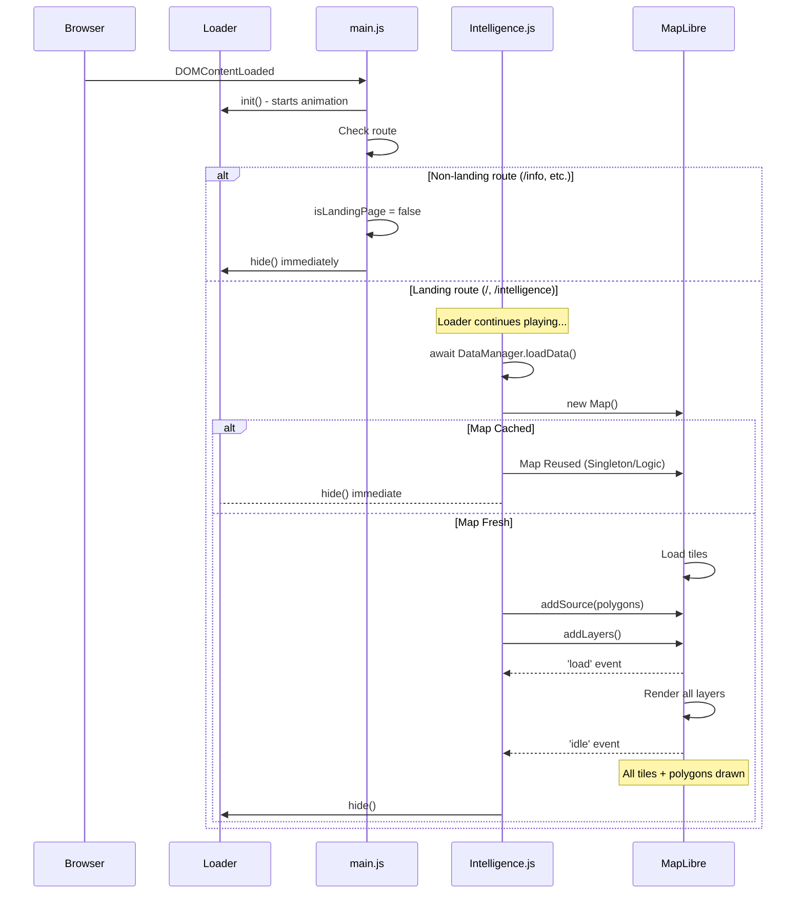

# Project Architecture & Documentation

> **Document Purpose**: A holistic reference guide for the Footfall application, covering the Intelligence Dashboard, Marketing/Info pages, data flow, and component structure.

---

## Table of Contents

1. [High-Level Overview](#high-level-overview)
2. [Routing & Navigation](#routing--navigation)
3. [File Structure](#file-structure)
4. [Core Components](#core-components)
5. [Intelligence Dashboard Architecture](#intelligence-dashboard-architecture)
    - [Data Layer](#data-layer)
    - [Map System](#map-system)
    - [User Flow](#user-flow)
6. [Info/Marketing Pages](#infomarketing-pages)

---

## High-Level Overview

Footfall is a Single Page Application (SPA) built with Vanilla JavaScript and MapLibre GL. It serves two primary functions:
1.  **Intelligence Dashboard** (`/`): An interactive map-based tool for real estate and trade area analysis.
2.  **Information & Marketing** (`/info`): A landing page showcasing the brand, testimonials, and contact information.

## Routing & Navigation

The application uses a custom client-side `Router` class (`src/router.js`).

| Route | Component | Purpose |
|-------|-----------|---------|
| `/` | `Intelligence` | **Main App**. Full-screen map dashboard. |
| `/intelligence` | `Intelligence` | Alias for dashboard. |
| `/info` | `Home` | Marketing content (About, Testimonials, Contact). |

**Navigation Logic**:
- **Navbar**: The menu is accessible globally. Links like "About" or "Contact" point to `/info#section`.
- **Cross-Page Linking**: If a user is on the Dashboard (`/`) and clicks "About", the app navigates to `/info` and scrolls to `#about`.
- **Watermark**: The watermark logo on the Dashboard links to `/info`.

---

## File Structure

```
src/
├── components/
│   ├── navbar.js            # Global navigation
│   ├── loader.js            # App loading screen
│   └── ...
├── pages/
│   ├── intelligence.js      # Dashboard Logic (Main App)
│   ├── home.js              # Info/Marketing Page
│   └── contact.js           # (Legacy/Fallback)
├── data/
│   ├── geoData.js           # Geographic definitions
│   ├── dataManager.js       # Data fetching & processing
│   └── cityBorders.js       # Polygon data
├── styles/
│   ├── intelligence.css     # Dashboard styles
│   ├── width.css            # (Likely layout utilities)
│   └── ...
└── main.js                  # Entry point & Route definitions
```

---

## Core Components

### Navbar (`src/components/navbar.js`)
- Renders the top navigation bar.
- Handles mobile menu toggling.
- Manages routing for anchor links (intercepts clicks to handle SPA navigation).

### Router (`src/router.js`)
- Listens to `popstate` and `[data-link]` clicks.
- Renders page components into `#app`.
- Manages page transitions (fade in/out).

---

## Intelligence Dashboard Architecture

The **Intelligence Dashboard** is the core product. It allows users to explore trade areas in India and UAE.

### File Structure (Dashboard)
- **Logic**: `src/pages/intelligence.js` (Monolithic controller)
- **Styles**: `src/styles/intelligence.css`
- **Data**: `src/data/*`

### Data Layer

**1. geoData.js**:
Defines the hierarchy of regions:
- `countryPolygons`: GeoJSON for country fills (UAE).
- `countries`: Center points for camera transitions.
- `cities`: City boundaries and metadata.
- `tradeAreas`: Point data for specific trade areas.

**2. DataManager.js**:
- Fetches `public/intelligence_data.csv`.
- Parses and enriches `tradeAreas` with statistical data (footfall, demographics).
- **ID Mapping**: Maps CSV names to internal IDs (e.g., "Koregaon Park" -> `pune-kp`).

### Map System

Powered by **MapLibre GL** using **OpenFreeMap** tiles and **OSM** data.

**Key Layers**:
- **Global**: `country-fill` (UAE), `india-fill` (OSM India).
- **Country Level**: `cities-fill`, `cities-border` (Clickable city polygons).
- **City Level**: `trade-blobs` (Heatmap style), `trade-points` (Clickable pins), `3d-buildings`.

### User Flow

1.  **Global View**: Select a country (India/UAE).
2.  **Country View**: Select a city (e.g., Pune, Dubai).
3.  **City View**: Explore trade areas (Pins/Blobs).
4.  **Trade Area View**: Sidebar opens with detailed statistics charts.

**Wizard**: An onboarding overlay (`#wizard-overlay`) guides new users to select their preferences, though exploring freely is also possible.

**Intro Optimization**:
- **First Visit**: Full "FOOTFALL" scanner animation plays.
- **Return Visit**: Logic checks `sessionStorage`. If intro has played, it fast-tracks to the map tour, skipping the full scanner but keeping the small logo animation.

---

## Info/Marketing Pages

Implemented in `src/pages/home.js`.

**Sections**:
**Sections**:
1.  **About**: Founder profile and vision (Landing view for `/info`).
2.  **Testimonials (Clients)**: Infinite marquee of client feedback.
3.  **Contact**: Flip-card style contact section with form.

**Feature note**:
- The "Services" section was removed in v2 refactor.
- The "Hero" map section was removed from `/info` to eliminate redundancy with the main dashboard.

---

## Build & Development

**Scripts**:
- `npm run dev`: Start Vite development server.
- `npm run build`: Build for production (output to `dist/`).
- `npm run preview`: Preview production build locally.
- `npm run generate-data`: Run `scripts/generate-geo-data.js` to process GeoJSONs.

## Deployment & Build

- **Build Tool**: Vite
- **Entry**: `index.html` -> `src/main.js`
- **Assets**: `public/` (GeoJSONs, CSVs, Images)
- **Styles**: CSS Variables defined in `src/style.css`.

---

## Loader & Resource Loading Flow

This system ensures no "Flash of Unstyled Data" by synchronizing map rendering with the UI loader.



### What "Idle" Guarantees

MapLibre's `idle` event fires when:
1. All **tiles** for the current viewport are downloaded and decoded.
2. All **GeoJSON sources** are parsed and their geometries uploaded to GPU.
3. All **layers** (fills, lines, symbols) are rendered to the frame buffer.

This ensures the user never sees a blank or partially-rendered map when the loader vanishes.
