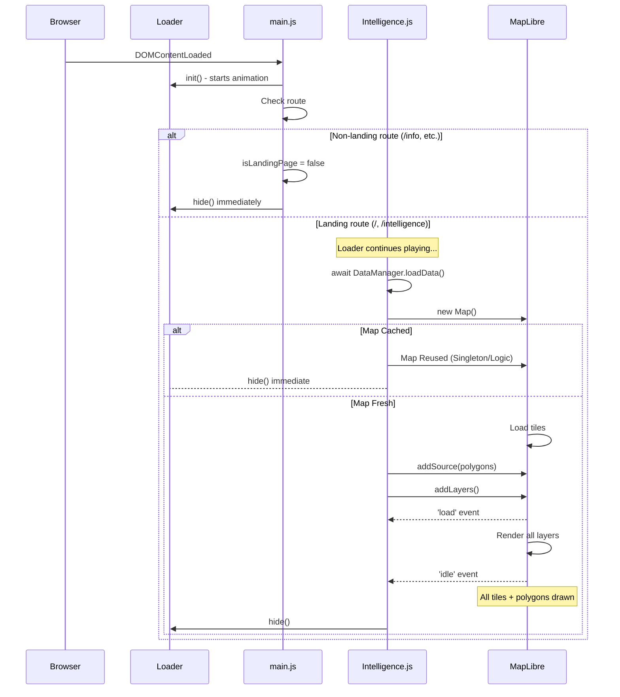

# Project Architecture & Documentation

> **Document Purpose**: A holistic reference guide for the Footfall application, covering the Intelligence Dashboard, Marketing/Info pages, data flow, and component structure.

---

## Table of Contents

1. [High-Level Overview](#high-level-overview)
2. [Routing & Navigation](#routing--navigation)
3. [File Structure](#file-structure)
4. [Core Components](#core-components)
5. [Intelligence Dashboard Architecture](#intelligence-dashboard-architecture)
    - [Data Layer](#data-layer)
    - [Map System](#map-system)
    - [User Flow](#user-flow)
6. [Info/Marketing Pages](#infomarketing-pages)

---

## High-Level Overview

Footfall is a Single Page Application (SPA) built with Vanilla JavaScript and MapLibre GL. It serves two primary functions:
1.  **Intelligence Dashboard** (`/`): An interactive map-based tool for real estate and trade area analysis.
2.  **Information & Marketing** (`/info`): A landing page showcasing the brand, testimonials, and contact information.

## Routing & Navigation

The application uses a custom client-side `Router` class (`src/router.js`).

| Route | Component | Purpose |
|-------|-----------|---------|
| `/` | `Intelligence` | **Main App**. Full-screen map dashboard. |
| `/intelligence` | `Intelligence` | Alias for dashboard. |
| `/info` | `Home` | Marketing content (About, Testimonials, Contact). |

**Navigation Logic**:
- **Navbar**: The menu is accessible globally. Links like "About" or "Contact" point to `/info#section`.
- **Cross-Page Linking**: If a user is on the Dashboard (`/`) and clicks "About", the app navigates to `/info` and scrolls to `#about`.
- **Watermark**: The watermark logo on the Dashboard links to `/info`.

---

## File Structure

```
src/
├── components/
│   ├── navbar.js            # Global navigation
│   ├── loader.js            # App loading screen
│   └── ...
├── pages/
│   ├── intelligence.js      # Dashboard Logic (Main App)
│   ├── home.js              # Info/Marketing Page
│   └── contact.js           # (Legacy/Fallback)
├── data/
│   ├── geoData.js           # Geographic definitions
│   ├── dataManager.js       # Data fetching & processing
│   └── cityBorders.js       # Polygon data
├── styles/
│   ├── intelligence.css     # Dashboard styles
│   ├── width.css            # (Likely layout utilities)
│   └── ...
└── main.js                  # Entry point & Route definitions
```

---

## Core Components

### Navbar (`src/components/navbar.js`)
- Renders the top navigation bar.
- Handles mobile menu toggling.
- Manages routing for anchor links (intercepts clicks to handle SPA navigation).

### Router (`src/router.js`)
- Listens to `popstate` and `[data-link]` clicks.
- Renders page components into `#app`.
- Manages page transitions (fade in/out).

---

## Intelligence Dashboard Architecture

The **Intelligence Dashboard** is the core product. It allows users to explore trade areas in India and UAE.

### File Structure (Dashboard)
- **Logic**: `src/pages/intelligence.js` (Monolithic controller)
- **Styles**: `src/styles/intelligence.css`
- **Data**: `src/data/*`

### Data Layer

The data pipeline uses a **build-time generation** approach. This ensures zero performance cost at runtime—the browser doesn't need to calculate colors, it just renders what was pre-calculated.

#### Data Flow Explanation

**1. Raw Data Input (`.csv`)**
*   **Source:** We maintain CSV files in `data-sources/countries/` (e.g., `uae.csv`, `india.csv`).
*   **Content:** Key columns include `tat_tier` (e.g., "TAT-1 (CBD)") and `corridor_type` (e.g., "High Street").

**2. Build Process (`generate-geo-data.js`)**
*   **Trigger:** Runs on `npm run generate-data` (or `npm run build`).
*   **Logic:** Reads CSVs, applies color logic (Nightlife=Purple, Mall=Dark, CBD=Red, etc.), and generates filtering fields.
*   **Output:** Generates `src/data/geoData.js` containing the final JSON object with determined colors.

**3. Runtime Ingestion (`intelligence.js`)**
*   **Import:** App imports the pre-generated `geoData` object.
*   **Rendering:** Visualizes data using the pre-calculated `color` property directly in MapLibre's paint system.

#### Data Flow Diagram

```
📁 data-sources/countries/*.csv    (Trade area raw data)
         ↓
   scripts/generate-geo-data.js    (Generates colors, filters, TAT logic)
         ↓
   src/data/geoData.js             (Auto-generated - DO NOT EDIT)


📁 src/data/*.geojson              (City boundary polygons)
         ↓
   scripts/prepare_data.cjs        (Combines into single module)
         ↓
   src/data/cityBorders.js         (Auto-generated - DO NOT EDIT)
```

#### Files

| File | Purpose | Editable? |
|------|---------|-----------|
| `data-sources/countries/*.csv` | Raw trade area data: coords, TAT tiers, corridors, rent, footfall, brands | ✅ Edit this |
| `scripts/generate-geo-data.js` | Build script: reads CSV, applies TAT color logic, generates filtering fields | ✅ Edit color rules here |
| `scripts/prepare_data.cjs` | Build script: combines city GeoJSON files into `cityBorders.js` | ✅ Edit city config here |
| `src/data/geoData.js` | **Auto-generated** - Trade areas with colors, consumed by app | ❌ Don't edit manually |
| `src/data/cityBorders.js` | **Auto-generated** - City polygons, consumed by app | ❌ Don't edit manually |
| `src/data/dataManager.js` | **DEPRECATED** - Legacy file, only has recommendation scoring | 🚫 Ignore |

### TAT Classification System

The application uses a **Dual-Layer Classification** system:

**1. Primary Tiers (Business Potential)**
Determines the primary economic classification of the trade area.

| Tier | Label | Color | Hex | Condition |
|------|-------|-------|-----|-----------|
| **TAT-1** | Central Business District | Red | `#E53935` | High density, premium catchment |
| **TAT-2** | Peripheral Business District | Orange | `#FF9800` | Emerging business districts |
| **TAT-3** | Tertiary Business District | Blue | `#2196F3` | Developing or residential-heavy zones |

**2. Sub-Trade Areas (Characteristics)**
Additional attributes that describe specific vibes or catchments.

| Type | Label | Color | Hex | Condition |
|------|-------|-------|-----|-----------|
| **Nightlife** | High Energy | Purple | `#9C27B0` | High concentration of bars/pubs |
| **Mall** | Mall Catchment | Dark | `#424242` | Anchored by major shopping malls |

> **Note:** In the UI (City View & Trade Area View), trade areas are categorized by their **Primary Tier**, with Nightlife/Mall displayed as a supplementary attribute.

### Map System

Powered by **MapLibre GL** using **OpenFreeMap** tiles and **OSM** data.

**Key Layers**:
- **Global**: `country-fill` (UAE), `india-fill` (OSM India).
- **Country Level**: `cities-fill`, `cities-border` (Clickable city polygons).
- **City Level**: `trade-blobs` (Heatmap style), `trade-points` (Clickable pins), `3d-buildings`.

### User Flow

1.  **Global View**: Select a country (India/UAE).
2.  **Country View**: Select a city (e.g., Pune, Dubai).
3.  **City View**: Explore trade areas (Pins/Blobs).
4.  **Trade Area View**: Sidebar opens with DCB tabs (Demographics, Commercial, Brandscape).

**Wizard**: An onboarding overlay (`#wizard-overlay`) guides new users to select their preferences, though exploring freely is also possible.

**Customisation Panel**: Users can filter trade areas by category, property size, and ticket size. Matched results appear in a separate panel.

**Intro Optimization**:
- **First Visit**: Full "FOOTFALL" scanner animation plays.
- **Return Visit**: Logic checks `sessionStorage`. If intro has played, it fast-tracks to the map tour, skipping the full scanner but keeping the small logo animation.

---

## Info/Marketing Pages

Implemented in `src/pages/home.js`.

**Sections**:
**Sections**:
1.  **About**: Founder profile and vision (Landing view for `/info`).
2.  **Testimonials (Clients)**: Infinite marquee of client feedback.
3.  **Contact**: Flip-card style contact section with form.

**Feature note**:
- The "Services" section was removed in v2 refactor.
- The "Hero" map section was removed from `/info` to eliminate redundancy with the main dashboard.

---

## Build & Development

### npm Scripts

| Command | Description |
|---------|-------------|
| `npm run dev` | Start Vite development server (fast, no data regen) |
| `npm run build` | **Production build**: runs `prepare-all` then builds |
| `npm run preview` | Preview production build locally |
| `npm run prepare-all` | Regenerates both city borders AND trade areas |
| `npm run prepare-cities` | Regenerates city borders only (`cityBorders.js`) |
| `npm run generate-data` | Regenerates trade areas only (`geoData.js`) |

### When to Run Data Scripts

| Scenario | Command |
|----------|---------|
| Added/edited trade area in CSV | `npm run generate-data` |
| Changed color logic in build script | `npm run generate-data` |
| Added new city GeoJSON | `npm run prepare-cities` |
| Before deploying to production | `npm run build` (auto-runs both) |
| Just editing CSS/JS (no data changes) | Nothing - hot reload works |

## Deployment & Build

- **Build Tool**: Vite
- **Entry**: `index.html` -> `src/main.js`
- **Assets**: `public/` (GeoJSONs, CSVs, Images)
- **Styles**: CSS Variables defined in `src/style.css`.

---

## Loader & Resource Loading Flow

This system ensures no "Flash of Unstyled Data" by synchronizing map rendering with the UI loader.


```mermaid
sequenceDiagram
    participant Browser
    participant Loader
    participant main.js
    participant Intelligence.js
    participant MapLibre

    Browser->>main.js: DOMContentLoaded
    main.js->>Loader: init() - starts animation
    main.js->>main.js: Check route
    alt Non-landing route (/info, etc.)
        main.js->>main.js: isLandingPage = false
        main.js->>Loader: hide() immediately
    else Landing route (/, /intelligence)
        Note over Intelligence.js: Loader continues playing...
        Intelligence.js->>Intelligence.js: await DataManager.loadData()
        Intelligence.js->>MapLibre: new Map()
        
        alt Map Cached
             Intelligence.js->>MapLibre: Map Reused (Singleton/Logic)
             Intelligence.js-->Loader: hide() immediate
        else Map Fresh
             MapLibre->>MapLibre: Load tiles
             Intelligence.js->>MapLibre: addSource(polygons)
             Intelligence.js->>MapLibre: addLayers()
             MapLibre-->>Intelligence.js: 'load' event
             MapLibre->>MapLibre: Render all layers
             MapLibre-->>Intelligence.js: 'idle' event
             Note over MapLibre: All tiles + polygons drawn
             Intelligence.js->>Loader: hide()
        end
    end
```

### What "Idle" Guarantees

MapLibre's `idle` event fires when:
1. All **tiles** for the current viewport are downloaded and decoded.
2. All **GeoJSON sources** are parsed and their geometries uploaded to GPU.
3. All **layers** (fills, lines, symbols) are rendered to the frame buffer.

This ensures the user never sees a blank or partially-rendered map when the loader vanishes.
